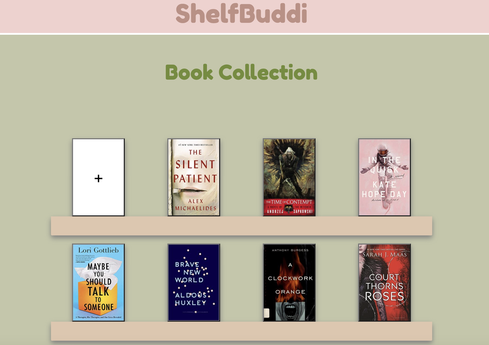

# ShelfBuddi
Does your large collection of books overwhelm you? Do you want to read your unread books before buying more? ShelfBuddi can help you achieve your reading goals. This app allows you to log your book collection into one place to categorize and organize as you read through your book shelf.

## Technologies Used
* JavaScript
* HTML
* CSS
* Bootstrap

## Getting Started

To access this app use this link.

Once your account is made and you have signed in, click the empty book on the shelf to log your first book and then you're off! 

## Next Steps

### Version 2
* As the user I want to be able to categorize the logged books so I can filter by different fields
* As the user I want to have a search bar to look for a specific book
* As the user I want to be able to group all books in a series together
* As the user I want to be able to mark a book "read" so I see what I have left unread
* As the user I want to be able to see the books marked "read" move to a different shelf to separate the read from the unread
* As the user I want to be able to create a favorites list

### Version 3
* As the user I want to be able to change the color scheme of my book shelf
* As the user I was to be able to share my book reviews on social media
* As the user I would like to be able to have a five-star rating system for book reviews
* As the user I want to have a function where I can just scan the ISBN and it generates the book informtion